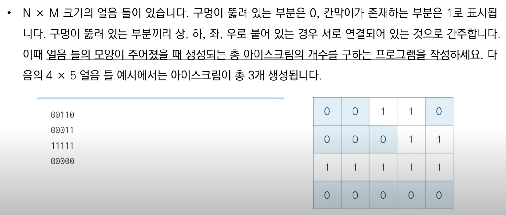
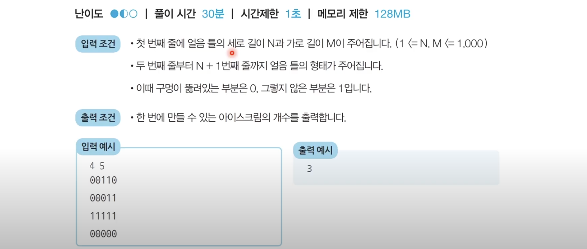
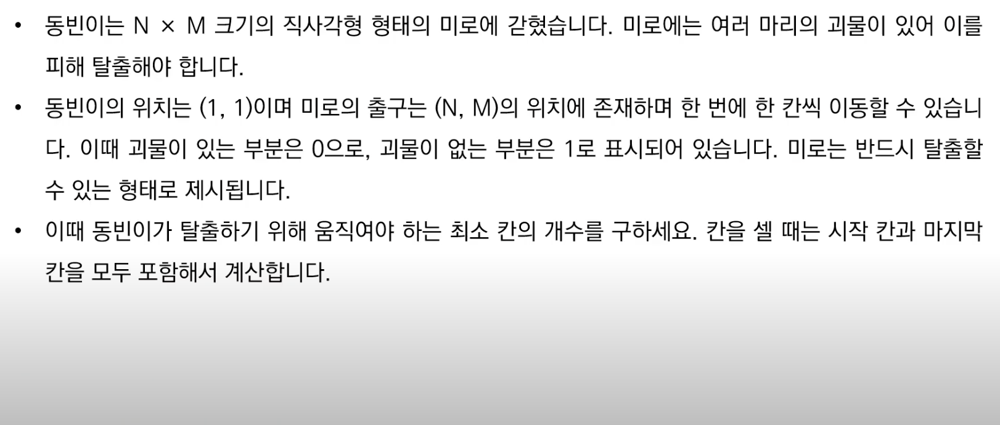
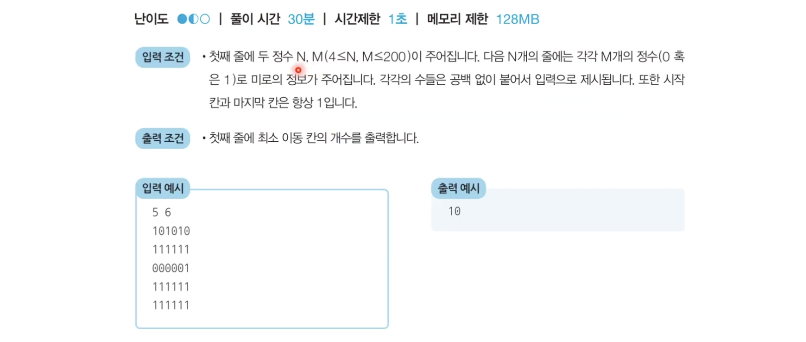

[](https://www.youtube.com/watch?v=7C9RgOcvkvo)

# 그래프 탐색 알고리즘 (DFS / BFS)
- 탐색이란 많은 양의 데이터 중에서 `원하는 데이터를 찾는 과정`을 말함

## 선수 지식
### 스택
- 선입후출의 자료구조
- `입구와 출구가 동일한 형태`

### 큐
- 선입선출의 자료구조
- `입구와 출구가 모두 뚫려 있는 터널과 같은 형태`

### 재귀 함수
- 자기 자신을 다시 호출하는 함수
- 문제 풀이에서 사용할 때는 `재귀 함수 종료 조건을 반드시 명시`해야 함
- 예제
```python
def recursive_function(i):
    # 종료 조건 명시
    if i == 100: return
    recursive_function(i + 1)

recursive_function()
```

> 함수에 대한 정보가 스택 프레임에 담기게 됨

### 팩토리얼 구현 예제
```python
# 반복적으로 구현
def factorial_iterative(n):
    result = 1
    for i in range(1, n+1): result *= i
    return result

# 재귀적으로 구현
def factorial_recursive(n):
    if n <= 1: return 1
    return n * factorial_recursive(n-1)
```

### 유클리드 호제법
- `두 개의 자연수에 대한 최대공약수`를 구하는 대표적인 알고리즘
- 재귀함수를 효과적으로 사용할 수 있음
- 예제
```python
def gcd(a, b):
    if a % b == 0: return b
    else: return gcd(b, a % b)
```

> 스택을 사용할 때 구현상 스택 라이브러리 대신에 재귀 함수를 이용하는 경우가 많음

## DFS (Depth-First Search)
- `깊이 우선 탐색`이라고도 부르며, 그래프에서 `깊은 부분을 우선적으로 탐색하는 알고리즘`
- 스택 자료구조(혹은 재귀 함수) 이용
- 예제
```python
def dfs(graph, v, visited):
    # 현재 노드 방문 처리
    visited[v] = True
    print(v, end=' ')

    # 현재 노드와 연결된 다른 노드를 재귀적으로 방문
    for i in graph[v]:
        if not visited[i]:
            dfs(graph, i, visited)

# 각 노드가 연결된 정보를 표현
graph = [
    [],
    [2, 3, 8],
    [1, 7],
    [1, 4, 5],
    [3, 5],
    [3, 4],
    [7],
    [2, 6, 8],
    [1, 7]
]

# 각 노드가 방문된 정보를 표현
visited = [False] * 9

# 실행
dfs(graph, 1, visited)
```

## BFS (Breadth-First Search)
- `너비 우선 탐색`이라고도 부르며, 그래프에서 `가까운 노드부터 우선적으로 탐색하는 알고리즘`
- 큐 자료구조 이용
- 예제
```python
from collections import deque

def bfs(graph, start, visited):
    queue = deque([start])

    # 현재 노드 방문 처리
    visited[start] = True

    # 큐가 빌 때까지 반복
    while queue:
        v = queue.popleft()
        print(v, end=' ')

        # 아직 방문하지 않은 인접한 원소들 큐에 삽입
        for i inn graph[v]:
            if not visited[i]:
                queue.append(i)
                visited[i] = True

# 각 노드가 연결된 정보를 표현
graph = [
    [],
    [2, 3, 8],
    [1, 7],
    [1, 4, 5],
    [3, 5],
    [3, 4],
    [7],
    [2, 6, 8],
    [1, 7]
]

# 각 노드가 방문된 정보를 표현
visited = [False] * 9

# 실행
bfs(graph, 1, visited)
```

## DFS/BFS 문제 풀이
1. 음료수 얼려 먹기


- 답안 (동빈나 풀이)
```python
def dfs(x, y):
    # 주어진 범위를 벗어나는 경우에는 즉시 종료
    if x <= -1 or x >= n or y <= -1 or y >= m:
        return False

    # 현재 노드를 아직 방문하지 않았다면
    if graph[x][y] == 0:
        # 해당 노드 방문 처리
        graph[x][y] = 1
        # 상, 하, 좌, 우의 위치들도 모두 재귀적으로 호출
        dfs(x-1, y)
        dfs(x, y-1)
        dfs(x+1, y)
        dfs(x, y+1)
        return True

    return False

n, m = map(int, input().split())

graph = []
for i in range(n):
    graph.append(list(map(int, input())))

result = 0
for i in range(n):
    for j in range(m):
        if dfs(i, j) == True:
            result += 1

print(result)
```

2. 미로 탈출


- 답안 (동빈나 풀이)
```python
from collections import deque

def bfs(x, y):
    queue = deque()
    queue.append((x, y))

    # 큐가 빌 때까지 반복
    while queue:
        x, y = queue.popleft()
        # 현재 위치에서 4가지 방향으로의 위치 확인
        for i in range(4):
            nx = x + dx[i]
            ny = y + dy [i]
            # 미로 찾기 공간을 벗어난 경우 무시
            if nx < 0 or nx >= n or ny < 0 or ny >= m:
                continue
            # 벽인 경우 무시
            if graph[nx][ny] == 0:
                continue
            # 해당 노드를 처음 방문하는 경우에만 최단 거리 기록
            if graph[nx][ny] == 1:
                graph[nx][ny] = graph[x][y] + 1
                queue.append((nx, ny))
    
    # 가장 오른쪽 아래까지의 최단 거리 반환
    return graph[n-1][m-1]

n, m = map(int, input().split())

graph = []
for i in range(n):
    graph.append(list(map(int, input())))

dx = [-1 , 1, 0, 0]
dy = [0, 0, -1, 1]

print(bfs(0, 0))
```