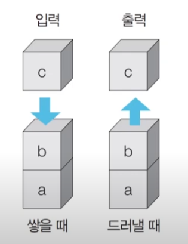
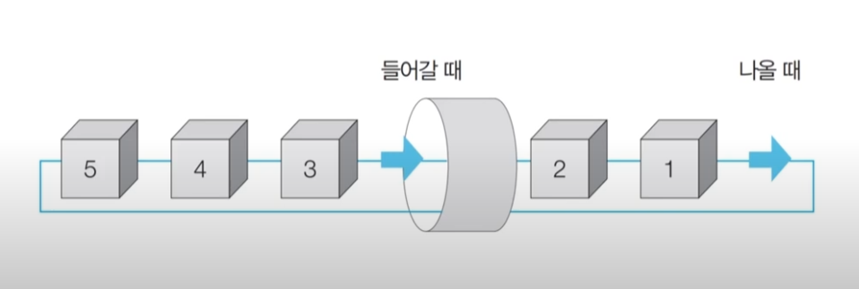

## 목차
1. [스택과 큐](#1-stack,queue)
2. [재귀 함수](#2-recursive_Function)
3. [DFS, BFS](#3-DFS,BFS)

---

## 1. 스택과 큐

### 개념
- **스택**: 먼저 들어 온 데이터가 나중에 나가는 형식(선입후출)의 자료구조
- 입구와 출구가 동일한 형태로 스택을 시각화 할 수 있음


### 구현 예제

#### 스택(Python)

**Python 코드**
```python
stack = []

stack.append(5)
stack.append(2)
stack.append(3)
stack.append(7)
stack.pop()
stack.append(1)
stack.append(4)
stack.pop()

print(stack[::-1])
print(stack)
```
---

### 개념
- **큐**: 먼저 들어 온 데이터가 먼저 나가는형식(선입선출)의 자료구조
- 큐는 입구와 출구가 모두 뚫려 있는 터널과 같은 형태임


### 구현 예제

#### 큐(Python)

**Python 코드**
```python
from collections import deque

queue = deque()

queue.append(5)
queue.append(2)
queue.append(3)
queue.append(7)
queue.popleft()
queue.append(1)
queue.append(4)
queue.popleft()

print(queue)
queue.reverse()
print(queue)
```
---

## 2. 재귀 함수(Recursive Function)

### 특징
- 종료 조건을 명시 해야함
- 컴퓨터의 스택 영역에 쌓임 그래서 스택을 구현할 때 스택대신 재귀 함수를 쓰는 경우가 있음
- 예시: 
```python
def recursive_function(i):
    # 100번째 호출을 했을 때 종료되도록 종료 조건 명시
    if i == 100:
        return
    print(i, '번째 재귀함수에서',i+1,'번째 재귀함수를 호출합니다.')
    recursive_function(i+1)
    print(i, '번째 재귀함수에서',i+1,'번째 재귀함수를 호출합니다.')

recursive_function(1)
```
### 구현 문제 유형
1. **팩토리얼**: n! = 1 x 2 x 3 x *** x (n - 1) x n
```python
def factorial_iterative(n):
    result = 1
    for i in range(1, n+1):
        result *= i
    return result

def factorial_recursive(n):
    if n <= 1:
        return 1
    return n * factorial_recursive(n - 1)
```
2. **최대공약수 계산 (유클리드 호제법) 예제**: 두 개의 자연수에 대한 최대공약수를 구하는 알고리즘
- 유클리드 호제법: 
    - 두 자연수 A, B 에 대하여 (A > B) A를 B로 나눈 나머지를 R이라고 합시다.
    - 이때 A와 B의 최대공약수는 B와 R의 최대공약수와 같음
```python
def gcd(a, b):
    if a % b == 0:
        return b
    else:
        return gcd(b, a % b)
```

## 3.1 DFS(Depth-First Search)

### 개념
- 깊이 우선 탐색이라고도 부르며 깊은 부분을 우선적으로 탐색하는 알고리즘
- 스택 자료구조를 이용
    - 1. 탐색 시작 노드를 스택에 삽입하고 방문 처리를 함
    - 2. 스택의 최상단 노드에 방문하지 않은 인접한 노드가 하나라도 있으면 그 노드를 스택에 넣고 방문 처리함. 방문하지 않은 인접 노드가 없으면 스택에서 최상단 노드를 꺼냄
    - 3. 더 이상 2번의 과정을 수행할 수 없을 때까지 반복함
```python
def dfs(graph, v, visited):
    # 현재 노드를 방문 처리
    visited[v] = True
    print(v, end=' ')
    # 현재 노드와 연결된 다른 노드들을 재귀적으로 방문
    for i in graph[v]:
        if not visited[i]:
            dfs(graph, i, visited)
```

## 3.2 BFS(Breadth-First Search)

### 개념
- 너버 우선 탐색이라고도 부르며, 그래프에서 가까운 노드부터 우선적으로 탐색하는 알고리즘
- 큐 자료구조를 이용
    - 1. 탐색 시작 노드를 큐에 삽입하고 방문 처리를 함 
    - 2. 큐에서 노드를 꺼낸 뒤에 해당 노드이 인접 노드 중 방문하지 않는 노드를 모두 큐에 삽입하고 방문 처리
    - 3. 더 이상 2번의 과정을 수행할 수 없을 때까지 반복함
```python
from collections import deque

def bfs(graph, start, visited):
    queue = deque([start])
    visited[start]=True
    while queue:
        v = queue.popleft()
        print(v, end=' ')
        for i in graph[v]:
            if not visited[i]:
                queue.append(i)
                visited[i] = True

```
### 문제 목록

#### 음료수 얼려 먹기

**문제 설명**
- N × N 크기의 얼음 틀이 있음
- 구멍 0, 칸막이 1 
- 구멍이 뚫려 있는 부분끼리 상, 하, 좌, 우로 붙어 있는 경우 서로 연결되어 있는 것으로 간주
- 얼음 틀의 모양이 주어졌을 때 생성되는 총 아이스크림의 개수를 구하는 프로그램 작성


**접근 방법**
- 특정한 지점의 상, 하, 좌, 우를 살펴본 뒤에 주변 지점 값 0 아직방문x 해당지점 방문
- 방문한 지점에서 다시 상하좌우를 보고 연결된 모든 지점을 방문가능
- 모든 노드에 대하여 1 ~ 2 번의 과정을 반복하며, 방문하지 않은 지점 수 카운트

**Python 코드(동빈나의 풀이)**
```python
# N, M을 공백을 기준으로 구분하여 입력 받기
n, m = map(int, input().split())

# 2차원 리스트의 맵 정보 입력 받기
graph = []
for i in range(n):
    graph.append(list(map(int, input())))

# DFS로 특정한 노드를 방문한 뒤에 연결된 모든 노드들도 방문
def dfs(x, y):
    # 주어진 범위를 벗어나는 경우에는 즉시 종료
    if x <= -1 or x >= n or y <= -1 or y >= m:
        return False
    # 현재 노드를 아직 방문하지 않았다면
    if graph[x][y] == 0:
        # 해당 노드 방문 처리
        graph[x][y] = 1
        # 상, 하, 좌, 우의 위치들도 모두 재귀적으로 호출
        dfs(x - 1, y)
        dfs(x, y - 1)
        dfs(x + 1, y)
        dfs(x, y + 1)
        return True
    return False

# 모든 노드(위치)에 대하여 음료수 채우기
result = 0
for i in range(n):
    for j in range(m):
        # 현재 위치에서 DFS 수행
        if dfs(i, j) == True:
            result += 1

print(result) # 정답 출력
```

---

#### 미로 탈출 

**문제 설명**
- 동빈이는 N x M 크기의 직사각형 형태의 미로에 갇힘
- 동빈이의 위치는 (1, 1)이며 (N, M) 위치에나가는 곳이 있음 한번에 한칸씩만 가능함
- 괴물은 0에 있고 없는 곳은 1임
- 이때 동빈이가 탈출하기 위해 움직여야 하는 최소 값의 개수는 뭘까요???

**접근 방법**
- BFS는 시작 지점에서 가까운 노드부터 차례대로 그래프의 모든 노드를 탐색
- 상, 하, 좌, 우 로 연결된 모든 노드로의 거리가 1로 동일함
- 3 x 3 크기의 미로가 있음

**Python 코드(동빈나의 풀이)**
```python
from collections import deque

# N, M을 공백을 기준으로 구분하여 입력 받기
n, m = map(int, input().split())
# 2차원 리스트의 맵 정보 입력 받기
graph = []
for i in range(n):
    graph.append(list(map(int, input())))

# 이동할 네 가지 방향 정의 (상, 하, 좌, 우)
dx = [-1, 1, 0, 0]
dy = [0, 0, -1, 1]

# BFS 소스코드 구현
def bfs(x, y):
    # 큐(Queue) 구현을 위해 deque 라이브러리 사용
    queue = deque()
    queue.append((x, y))
    # 큐가 빌 때까지 반복하기
    while queue:
        x, y = queue.popleft()
        # 현재 위치에서 4가지 방향으로의 위치 확인
        for i in range(4):
            nx = x + dx[i]
            ny = y + dy[i]
            # 미로 찾기 공간을 벗어난 경우 무시
            if nx < 0 or nx >= n or ny < 0 or ny >= m:
                continue
            # 벽인 경우 무시
            if graph[nx][ny] == 0:
                continue
            # 해당 노드를 처음 방문하는 경우에만 최단 거리 기록
            if graph[nx][ny] == 1:
                graph[nx][ny] = graph[x][y] + 1
                queue.append((nx, ny))
    # 가장 오른쪽 아래까지의 최단 거리 반환
    return graph[n - 1][m - 1]

# BFS를 수행한 결과 출력
print(bfs(0, 0))
```

---

## 출처
- [이것이 취업을 위한 코딩 테스트다 with 파이썬](https://www.youtube.com/watch?v=2zjoKjt97vQ&list=PLRx0vPvlEmdAghTr5mXQxGpHjWqSz0dgC&index=2)

---


