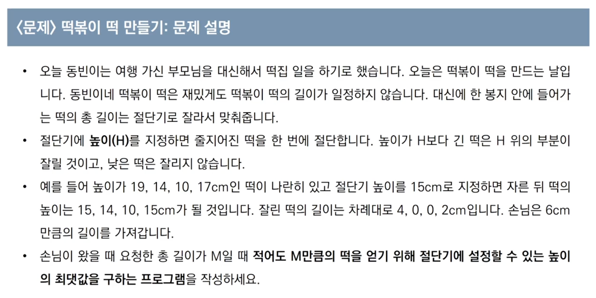
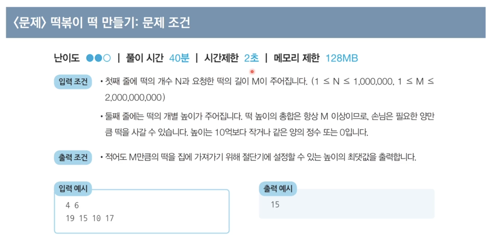
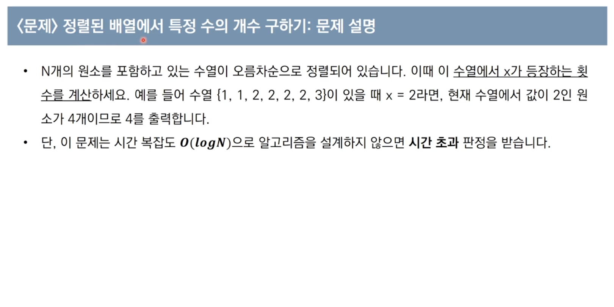
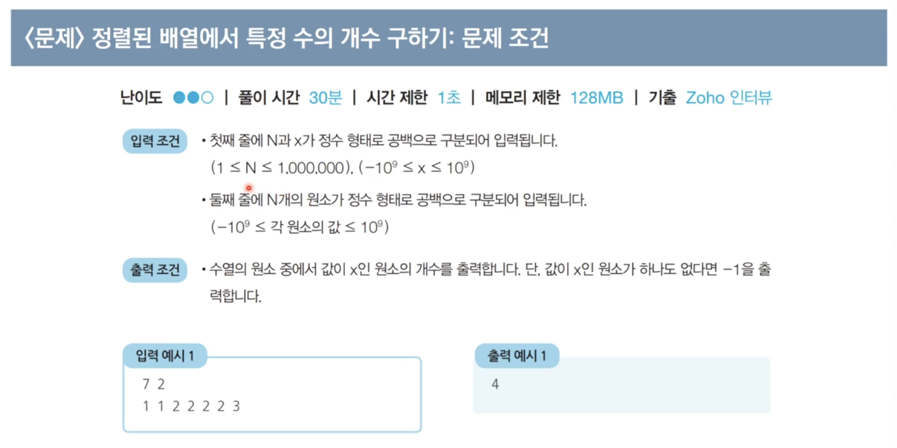

[](https://www.youtube.com/watch?v=94RC-DsGMLo)

# 이진 탐색 알고리즘
- 순차 탐색: 리스트 안에 있는 특정한 `데이터를 찾기 위해 앞에서부터 데이터를 하나씩 확인`하는 방법
- 이진 탐색: 정렬되어 있는 리스트에서 `탐색 범위를 절반씩 좁혀가며 데이터를 탐색`하는 방법
- 시간 복잡도: 탐색 범위를 절반씩 줄이며, 시간 복잡도는 $O(log N)$을 보장
- 이진 탐색 소스코드(재귀적 구현)
```python
def binary_search(array, target, start, end):
    if start > end: return None

    mid = (start + end) // 2

    if array[mid] == target: return mid
    elif array[mid] > target: return binary_search(array, target, start, mid-1)
    else: return binary_search(array, target, mid+1, end)

n, target = list(map(int, input().split()))
array = list(map(int, input().split()))

result = binary_search(array, target, 0, n-1)
if result == None: print('원소가 존재하지 않습니다')
else: print(result+1)
```
- 이진 탐색 소스코드(반복문 구현)
```python
def binary_search(array, target, start, end):
    while start <= end:
        mid = (start + end) // 2

        if array[mid] == target: return mid
        elif array[mid] > target: end = mid-1
        else: start = mid+1
    return None

n, target = list(map(int, input().split()))
array = list(map(int, input().split()))

result = binary_search(array, target, 0, n-1)
if result == None: print('원소가 존재하지 않습니다')
else: print(result+1)
```

## 파이썬 이진 탐색 라이브러리
- `bisect_left(a, x)`: 정렬된 순서를 유지하면서 배열 a에 x를 삽입할 가장 왼쪽 인덱스를 반환
- `bisect_right(a, x)`: 정렬된 순서를 유지하면서 배열 a에 x를 삽입할 가장 오른쪽 인덱스를 반환
- 코드
```python
from bisect import bisect_left, bisect_right

a = [1, 2, 4, 4, 8]
x = 4

print(bisect_left(a, x))
print(bisect_right(a, x))

# 결과
2
4
```
- 값이 특정 범위에 속하는 데이터 개수 구하기
```python
from bisect import bisect_left, bisect_right

def count_by_range(a, left_value, right_value):
    right_index = bisect_right(a, right_value)
    left_index = bisect_left(a, left_value)
    return right_index - left_index

a = [1, 2, 3, 3, 3, 3, 4, 4, 8, 9]

# 값이 4인 데이터 개수 출력
print(count_by_range(a, 4, 4))
# 값이 [-1, 3] 범위에 있는 데이터 개수 출력
print(count_by_range(a, -1, 3))

# 결과
2
6
```

## 파라메트릭 서치 (Parametric Search)
- 최적화 문제를 결정 문제('예' 혹은 '아니오')로 바꾸어 해결하는 기법
- 일반적으로 코딩 테스트에서 `이진 탐색을 이용하여 해결`


## 이진 탐색 문제 풀이
1. 떡볶이 떡 만들기


- 답안 (동빈나 풀이)
```python
n, m = list(map(int, input().split(' ')))
array = list(map(int, input().split()))

start = 0
end = max(array)

result = 0
while(start <= end):
    total = 0
    mid = (start + end) // 2

    for x in array:
        if x > mid:
            total += x - mid
    
    if total < m:
        end = mid - 1
    else:
        result = mid
        start = mid + 1

print(result)
```

2. 정렬된 배열에서 특정 수의 개수 구하기


- 답안 (동빈나 풀이)
```python
from bisect import bisect_left, bisect_right

def count_by_range(array, left_value, right_value):
    right_index = bisect_right(array, right_value)
    left_index = bisect_left(array, left_value)
    return right_index - left_index

n, x = map(int, input().split())
array = list(map(int, input().split()))

count = count_by_range(array, x, x)
if count == 0: print(-1)
else: print(count)
```