## 최단 경로 문제
최단 경로 알고리즘은 **가장 짧은 경로를 찾는 알고리즘**을 의미합니다. 
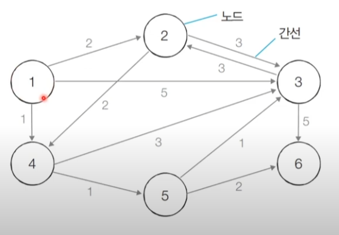
이런 케이스를 말한다고 할 수 있습니다.

### 다익스트라 최단 경로 알고리즘
**특정한 노드**에서 출발하여 **다른 모든 노드**로 가는 최단 경로를 계산함
다익스트라 최단 경로 알고리즘은 그리디 알고리즘으로 분류됨!... **매 상황에서 가장 비용이 적은 노드를 선택**해 임의의 과정을 반복한다고 할 수 있음.

#### 동작 과정
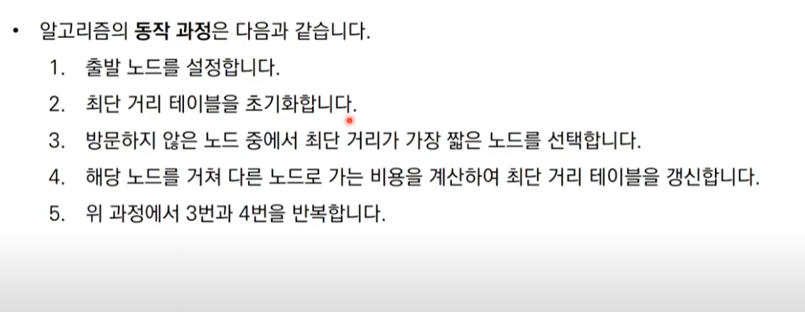
다음과 같음.. 
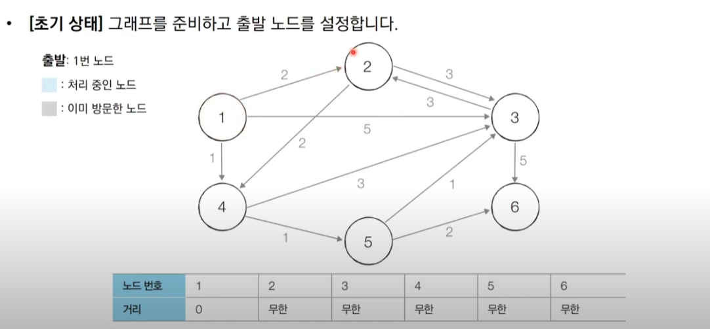
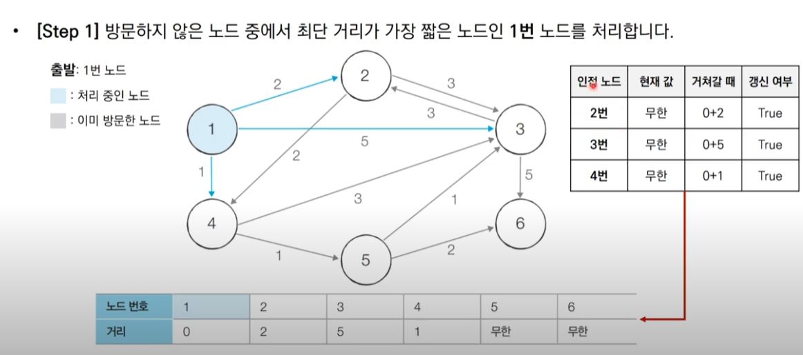
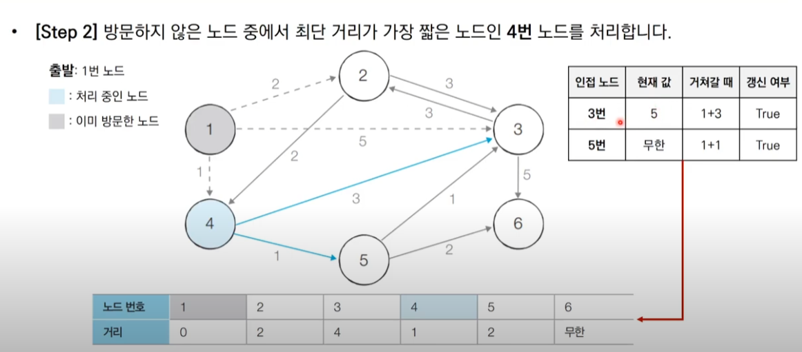
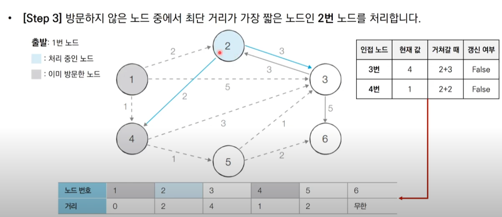
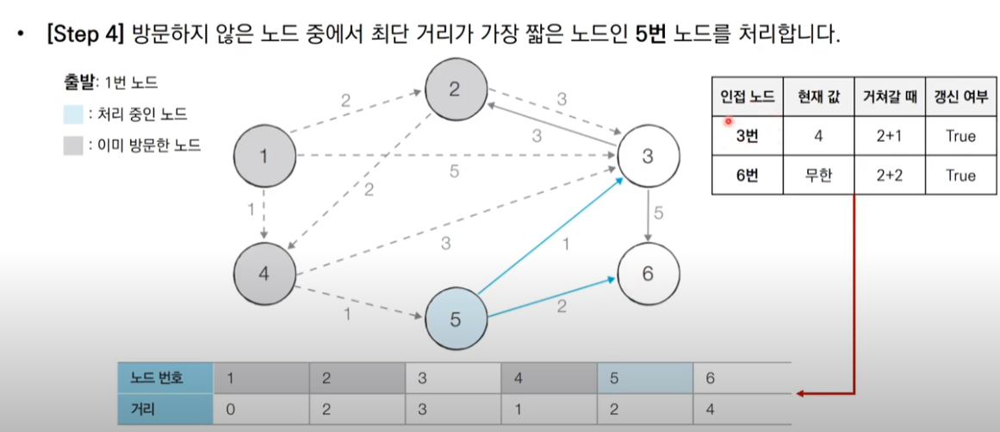
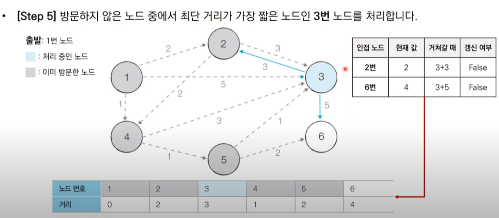
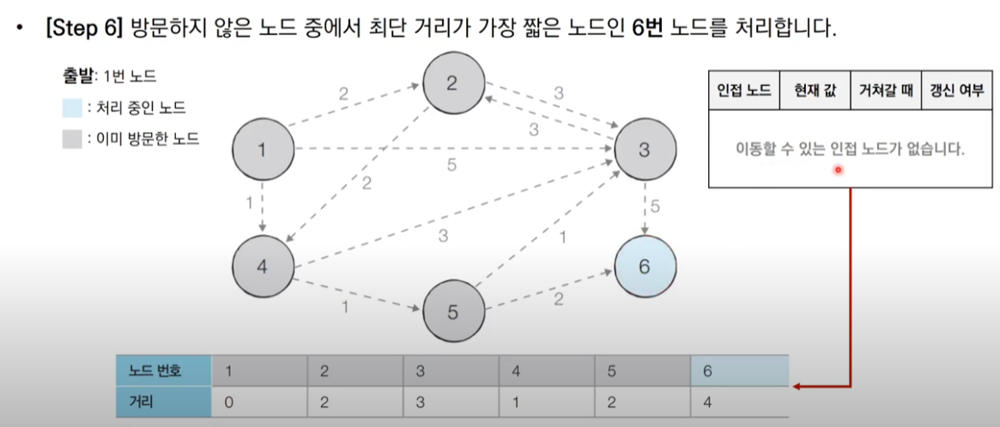

#### 특징
이처럼 다익스트라는 그리디 알고리즘이며 매 상황에서 방문하지 않은 가장 비용이 적은 노드를 선택해 임의의 과정을 반복함을 알 수 있다.
**한 번 처리된 노드의 최단 거리는 고정되어 더 이상 바뀌지 않음**
- 한 단계당 하나의 노드에 대한 최단 거리를 확실히 찾는 것으로 이해할 수 있음!
- 다익스트라 알고리즘을 수행한 뒤에 **테이블에 각 노드까지의 최단 거리 정보가 저장**됩니다.

#### 구현
- 단계마다 방문하지 않은 노드 중에서 최단 거리가 가장 짧은 노드를 선택하기 위해 **매 단계마다 1단계 테이블의 모든 원소를 확인(순차 탐색)함**
```python
import sys
input = sys.stdin.readline
INF = int(1e9) # 무한을 의미하는 값으로 10억을 설정

# 노드의 개수, 간선의 개수를 입력받기
n, m = map(int, input().split())
# 시작 노드 번호를 입력받기
start = int(input())
# 각 노드에 연결되어 있는 노드에 대한 정보를 담는 리스트를 만들기
graph = [[] for i in range(n + 1)]
# 방문한 적이 있는지 체크하는 목적의 리스트를 만들기
visited = [False] * (n + 1)
# 최단 거리 테이블을 모두 무한으로 초기화
distance = [INF] * (n + 1)

# 모든 간선 정보를 입력받기
for _ in range(m):
    a, b, c = map(int, input().split())
    # a번 노드에서 b번 노드로 가는 비용이 c라는 의미
    graph[a].append((b, c))

# 방문하지 않은 노드 중에서, 가장 최단 거리가 짧은 노드의 번호를 반환
def get_smallest_node():
    min_value = INF
    index = 0 # 가장 최단 거리가 짧은 노드(인덱스)
    for i in range(1, n + 1):
        if distance[i] < min_value and not visited[i]:
            min_value = distance[i]
            index = i
    return index

def dijkstra(start):
    # 시작 노드에 대해서 초기화
    distance[start] = 0
    visited[start] = True
    for j in graph[start]:
        distance[j[0]] = j[1]
    # 시작 노드를 제외한 전체 n - 1개의 노드에 대해 반복
    for i in range(n - 1):
        # 현재 최단 거리가 가장 짧은 노드를 꺼내서, 방문 처리
        now = get_smallest_node()
        visited[now] = True
        # 현재 노드와 연결된 다른 노드를 확인
        for j in graph[now]:
            cost = distance[now] + j[1]
            # 현재 노드를 거쳐서 다른 노드로 이동하는 거리가 더 짧은 경우
            if cost < distance[j[0]]:
                distance[j[0]] = cost

# 다익스트라 알고리즘을 수행
dijkstra(start)

# 모든 노드로 가기 위한 최단 거리를 출력
for i in range(1, n + 1):
    # 도달할 수 없는 경우, 무한(INFINITY)이라고 출력
    if distance[i] == INF:
        print("INFINITY")
    # 도달할 수 있는 경우 거리를 출력
    else:
        print(distance[i])
```
이런 코드인데 코드를 볼 때
```python
distance[start] = 0  # 시작 노드까지의 거리는 0
visited[start] = True  # 시작 노드는 방문 처리

for j in graph[start]:  # 시작 노드와 연결된 모든 간선을 확인
    distance[j[0]] = j[1]  # 연결된 노드까지의 거리를 직접 거리로 설정
```
이해가 안됬었는데
클로드가
# 시작 노드에 대해서 초기화
distance[start] = 0  # 시작 노드까지의 거리는 0
visited[start] = True  # 시작 노드는 방문 처리

for j in graph[start]:  # 시작 노드와 연결된 모든 간선을 확인
    distance[j[0]] = j[1]  # 연결된 노드까지의 거리를 직접 거리로 설정
예시로 이해하기
만약 그래프가 다음과 같다면:

시작 노드: 1
1 → 2 (거리 4)
1 → 3 (거리 2)
1 → 4 (거리 7)

pythongraph[1] = [(2, 4), (3, 2), (4, 7)]  # 노드 1과 연결된 간선들
다고 한다...


#### 간단한 구현 방법 성능 분석
- O(v)번에 걸쳐서 최단 거리가 가장 짧은 노드를 매번 선형 탐색해야 함
- 전체 시간 복잡도는 O(v^2)
- 최단 경로 문제에서 전체 노드가 5,000개 이하라면 이 코드로 문제를 해결할 수 있다. 
- 노드의 개수가 10,000개를 넘어가는 문제면 엄청 커진다..

### 우선순위 큐
- 우선순위가 가장 높은 데이터를 가장 먼저 삭제하는 자료구조


#### 힙(Heap)
- 우선순위 큐를 구현하기 위해 사용하는 자료구조 중 하나임
- **최소 힙**과 **최대 힙**이 있음
- 다익스트라 최단 경로 알고리즘을 포함해 다양한 알고리즘에서 사용됨
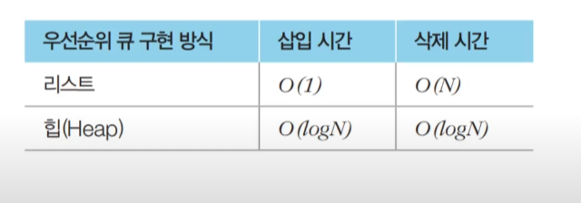

#### 구현
```python
import heapq

def heapsort(iterable):
    h = []
    result = []
    for value in iterable:
        heapq.heappush(h, value)
    
    for i in range(len(h)):
        result.append(heapq.heappop(h))
    return result

result = heapsort([1, 3, 5, 7, 9, 2, 4, 6, 8, 0])
print(result)
```

#### 개선된 구현법
- 방문하지 않은 노드 중에서 최단 거리가 가장 짧은 노드를 선택하기 위해 **힙(Heap)** 자료구조를 이용함.
- 다익스트라 알고리즘이 동작하는 **기본 원리는 동일**

#### 동작 과정
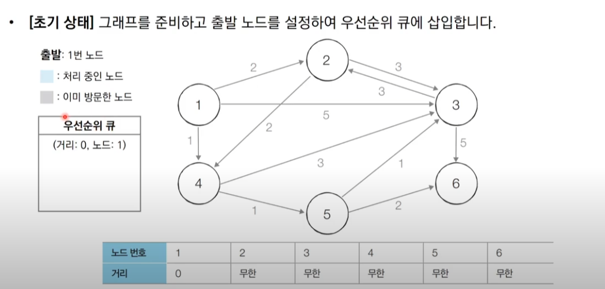
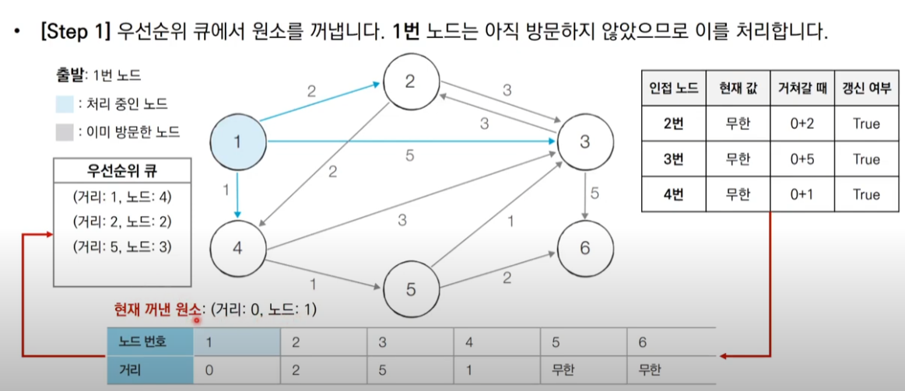
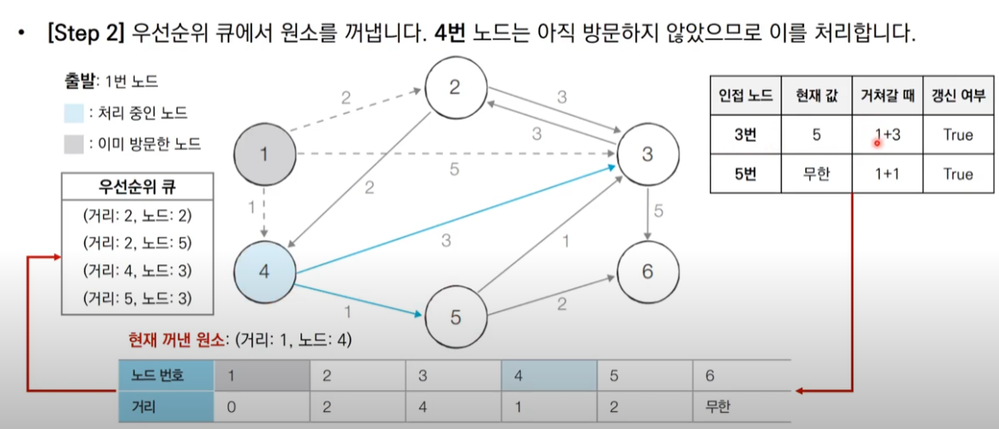
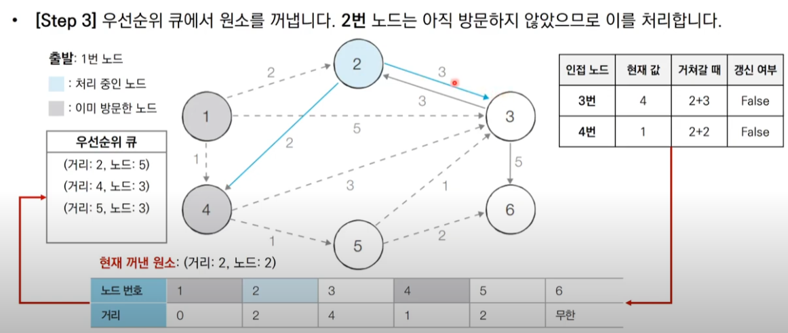
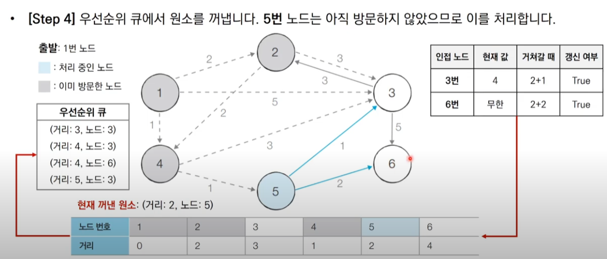
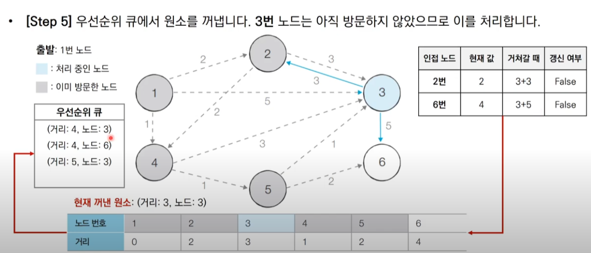
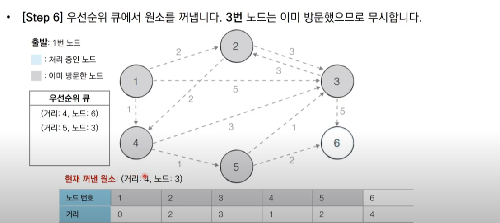
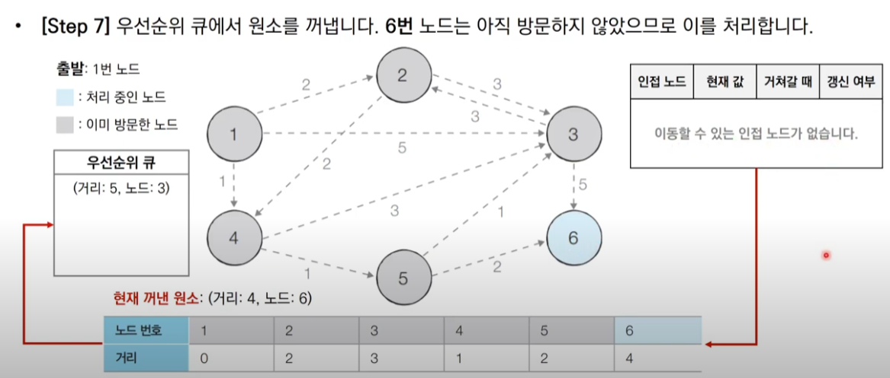
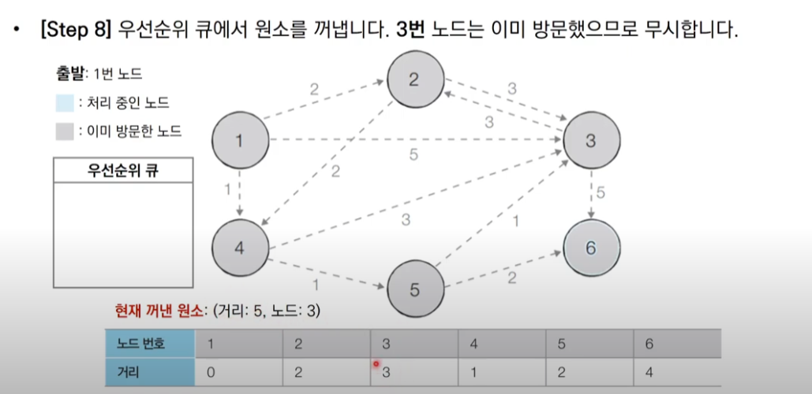
```python
import heapq
import sys
input = sys.stdin.readline
INF = int(1e9) # 무한을 의미하는 값으로 10억을 설정

# 노드의 개수, 간선의 개수를 입력받기
n, m = map(int, input().split())
# 시작 노드 번호를 입력받기
start = int(input())
# 각 노드에 연결되어 있는 노드에 대한 정보를 담는 리스트를 만들기
graph = [[] for i in range(n + 1)]
# 최단 거리 테이블을 모두 무한으로 초기화
distance = [INF] * (n + 1)

# 모든 간선 정보를 입력받기
for _ in range(m):
    a, b, c = map(int, input().split())
    # a번 노드에서 b번 노드로 가는 비용이 c라는 의미
    graph[a].append((b, c))

def dijkstra(start):
    q = []
    # 시작 노드로 가기 위한 최단 경로는 0으로 설정하여, 큐에 삽입
    heapq.heappush(q, (0, start))
    distance[start] = 0
    while q: # 큐가 비어있지 않다면
        # 가장 최단 거리가 짧은 노드에 대한 정보 꺼내기
        dist, now = heapq.heappop(q)
        # 현재 노드가 이미 처리된 적이 있는 노드라면 무시
        if distance[now] < dist:
            continue
        # 현재 노드와 연결된 다른 인접한 노드들을 확인
        for i in graph[now]:
            cost = dist + i[1]
            # 현재 노드를 거쳐서, 다른 노드로 이동하는 거리가 더 짧은 경우
            if cost < distance[i[0]]:
                distance[i[0]] = cost
                heapq.heappush(q, (cost, i[0]))

# 다익스트라 알고리즘을 수행
dijkstra(start)

# 모든 노드로 가기 위한 최단 거리를 출력
for i in range(1, n + 1):
    # 도달할 수 없는 경우, 무한(INFINITY)이라고 출력
    if distance[i] == INF:
        print("INFINITY")
    # 도달할 수 있는 경우 거리를 출력
    else:
        print(distance[i])
```
#### 개선된 구현 방법
- 힙 자료구조를 이용하는 다익스트라 알고리즘의 시간복잡도는 O(ElogV)임.
- 노드를 하나씩 꺼내 검사하는 반복문은 노드의 개수 V이상의 횟수로는 처리되지 X
- 전체 과정은 E개의 원소를 우선순위 큐에 넣었다가 모두 빼내는 연산과 매우 유사함
- 시간 복잡도를 O(ElogE)로 판단할 수 있음
- 중복 간선을 포함하지 않는 경우에 이를 O(ElogV)로 정리할 수 있음. 
- O(ElogE) -> O(ElogV^2) -> O(2ElogV) -> O(ElogV)

### 플로이드 워셜 알고리즘
- 모든 노드에서 다른 모든 노드까지의 최단 경로를 모두 계산함
- 플로이드 워셜 알고리즘은 다익스트라 알고리즘과 마찬가지로 **거쳐 가는 노드를 기준으로 알고리즘을 수행**
- 플로이드 워셜은 2차원 테이블에 최단 거리 정보를 저장함
